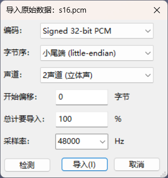

# AudioRecord

## FFmpeg API采集音频

### 1.采集PCM数据

#### 相关API

- av_find_input_format("dshow")：设置采集设备格式DirectShow

- avformat_open_input()：打开输入设备，需要指定设备名字,并且可以设置采集的参数(设备需要满足才能生效)

  - 使用命令行查询采集设备列表，以dshow格式为例

    ```
    ffmpeg -list_devices true -f dshow -i dummy
    ```

    

    其中：**"screen-capture-recorder" (video)** 和  **"virtual-audio-capturer" (audio)** 分别是屏幕录制和系统声音采集，需要安装Screen Capturer Recorder，链接[Screen Capturer Recorder](https://github.com/rdp/screen-capture-recorder-to-video-windows-free)

  - 使用命令行查询采集设备支持的参数，以**"麦克风 (Realtek(R) Audio)"** 和  **"virtual-audio-capturer"**为例子

    ```
    ffmpeg -f dshow -list_options true -i audio="virtual-audio-capturer"
    ffmpeg -f dshow -list_options true -i audio="麦克风 (Realtek(R) Audio)"
    ```

    

    ch:音频通道数、bits：音频采样大小(位深)、rate：采样率，可以通过FFmpeg的AVDictionary设置

    ```c++
    av_dict_set(&opt, "channels", "2", 0);
    av_dict_set(&opt, "sample_rate", "48000", 0);
    av_dict_set(&opt, "sample_size", "16", 0);
    
    ret = avformat_open_input(&ifmt_ctx, 
                              "audio=virtual-audio-capturer",   //麦克风 (Realtek(R) Audio)
                              ifmt, 
                              &opt);
    ```

- av_read_frame()：读取PCM数据帧

使用FFmpeg采集音频数据比较简单，具体可以参考`PCM.cpp`文件。需要进行重采样操作可以参考`Resampling.cpp`文件。

### 2.播放PCM数据

可以使用**Audacity**工具播放采集的音频数据，也开始直接使用ffplay播放。

#### 方式1：Audacity工具

下载地址：[Audacity ® | Downloads](https://www.audacityteam.org/download/)

文件-->导入-->导入原始数据-->设置相关参数-->导入-->播放



#### 方式2：ffplay命令行播放

FFmpeg-6.0版本之后关于声道布局的参数进行了修改，6.0以下使用的是 **"-ch"** 表示声道数量，6.0以上使用 **"-ch_layout"** 表示声道布局，比如立体音stereo

```
//6.0以下
ffplay -i s16.pcm -ar 48000 -ch 2 -f s16le

//6.0以上
ffplay -i s16.pcm -ar 48000 -ch_layout stereo -f s16le
```

参数说明：

-i 表示输入文件

-ar 表示采样率

-ch_layout 表示声道布局

-f 表示采样格式

### 3.音频重采样

音频重采样就是改变原始音频的采样格式、采样率、通道布局。使用FFmpeg API进行采样率的重采样会产生变速的问题，建议使用其他开源工具进行采样率的重采样。

还有FFmpeg API的重采样为**Planer**格式不能用来播放，因为Planer是FFmpeg内部用来存储的格式，正常使用的是packet格式(交错存储)。

#### 相关API

- swr_alloc()：初始化重采样上下文

- av_opt_set_xxx()：设置原格式和目标格式的重采样参数

  ```c++
  /* 设置参数 */
  av_opt_set_chlayout(swr_ctx, "in_chlayout",    &src_ch_layout, 0);
  av_opt_set_int(swr_ctx, "in_sample_rate",       src_rate, 0);
  av_opt_set_sample_fmt(swr_ctx, "in_sample_fmt", src_sample_fmt, 0);
  
  av_opt_set_chlayout(swr_ctx, "out_chlayout",    &dst_ch_layout, 0);
  av_opt_set_int(swr_ctx, "out_sample_rate",       dst_rate, 0);
  av_opt_set_sample_fmt(swr_ctx, "out_sample_fmt", dst_sample_fmt, 0);
  ```

- swr_init()：设置完参数后，初始化重采样上下文

- av_samples_alloc_array_and_samples()：分配样本缓冲区

  ```C++
  ret = av_samples_alloc_array_and_samples(&src_data, &src_linesize, src_nb_channels,
                                               src_nb_samples, src_sample_fmt, 0);
  ```

- av_rescale_rnd()：计算目标样本数

  ```c++
  dst_nb_samples = av_rescale_rnd(swr_get_delay(swr_ctx, src_rate) +
                                          src_nb_samples, dst_rate, src_rate, AV_ROUND_UP);
  ```

- swr_convert()：重采样

- av_samples_get_buffer_size()：计算目标样本缓冲区大小

  ```c++
  dst_bufsize = av_samples_get_buffer_size(&dst_linesize, dst_nb_channels,
                                                   ret, dst_sample_fmt, 1);
  
  fwrite(dst_data[0], 1, dst_bufsize, out2);  //重采样后的数据
  ```

以上就是FFmpeg重采样相关的API，具体代码参考:`Resampling.cpp`文件。

## FFmpeg API AAC编码

AAC编码使用的是libfdk_aac编码器，需要重新编译FFmpeg。

具体代码参考`libfdk_aac.cpp`，如果需要重采样或者需要写ADTS Header参考`Audio.cpp`

### 1.编码过程

#### 编码器相关AIP

##### 1.avcodec_find_encoder_by_name()

通过名字查找编码器

```c++
codec = avcodec_find_encoder_by_name("libfdk_aac");
```

##### 2.avcodec_alloc_context3()

使用编码(codec)初始化编码器上下文

```C++
codec_ctx = avcodec_alloc_context3(codec);
```

##### 3.设置编码参数

在编码器上下文中设置编码的相关参数，libfdk_aac仅支持AV_SAMPLE_FMT_S16采样格式

```c++
codec_ctx->codec_type = AVMEDIA_TYPE_AUDIO;
codec_ctx->bit_rate = 64 * 1024;
codec_ctx->ch_layout = AV_CHANNEL_LAYOUT_STEREO;
codec_ctx->sample_rate = 48000;
codec_ctx->profile = FF_PROFILE_AAC_HE_V2;		//三种模式 aac_low 128kb , aac_he 64kb  , aac_he_v2
codec_ctx->sample_fmt = AV_SAMPLE_FMT_S16;
```

##### 4.avcodec_open2()

绑定编码和编码上下文,后面就通过使用编码器上下文进行编码

```c++
ret = avcodec_open2(codec_ctx, codec, nullptr);
```

#### 编码相关API

##### 1.初始化AVframe

**注意**⚠️：此时的codec_ctx->frame_size可能不等于av_read_frame()中pkt.size()，即需求单通道样本数不等于实际样本数量，直接进行后续操作是会报错的或者编码的数据播放不正常。需要使用AVAudioFifo处理这种特殊情况。

```C++
frame = av_frame_alloc();
/* 每次送多少数据给编码器由：
*  (1)frame_size(每帧单个通道的采样点数);
*  (2)sample_fmt(采样点格式);
*  (3)channel_layout(通道布局情况);
*  3个要素决定
*/

frame->nb_samples = codec_ctx->frame_size;
frame->format = codec_ctx->sample_fmt;
frame->ch_layout = codec_ctx->ch_layout;

ret = av_frame_get_buffer(frame, 0);
```

```C++
//av_read_frame()的pkt.szie是1920，采集样本数小于4096，需要使用AVAudioFifo存储数据帧。
//设置大小为frame->nb_samples(单通道样本数)
audio_fifo = av_audio_fifo_alloc(codec_ctx->sample_fmt, frame->ch_layout.nb_channels, frame->nb_samples);
```

##### 2.avcodec_send_frame()

发送原始数据帧给编码器

```C++
ret = avcodec_send_frame(codec_ctx, frame);
if (ret < 0) {
    fprintf(stderr, "Error sending the frame to the encoder\n");
    exit(1);
}

while (ret >= 0) {
    //正常，进行进行后续操作
}
```

##### 3.avcodec_receive_packet()

接收编码后的压缩数据。

可能需要几帧AVFrame数据才能编码压缩成一帧pkt数据

```c++
ret = avcodec_receive_packet(codec_ctx, pkt);
if (ret == AVERROR(EAGAIN) || ret == AVERROR_EOF)
{
    av_packet_free(&pkt);
    return;
}

else if (ret < 0) {
    fprintf(stderr, "Error encoding audio frame\n");
    av_packet_free(&pkt);
    exit(1);
}

//正常，进行后续操作

av_packet_unref(pkt);
```

##### 4.最后冲刷编码器

最后可能所剩下的数据不够编码为一帧pkt数据，还需要继续发送数据。此时需要发送一个空的AVframe给编码器进行冲刷，将最后的数据编码为一帧数据。

```C++
if(frame)
{
    //释放frame后冲刷最后解码的数据，保证数据完整
    av_frame_free(&frame);
    Encodec(codec_ctx, frame, out2);
}
```

### 2.设置PTS

##### 1.**初始化PTS变量**

`base_pts` 用于记录第一个包的PTS，以便后续包的PTS可以从0开始计算。`current_pts` 用于记录当前处理的音频帧的PTS。

```c++
int64_t base_pts = 0;
int64_t current_pts = 0;
```

##### 2.**编码函数 `Encodec` 中的PTS调整**

- 在 `Encodec` 函数中，每次接收到编码后的包时，检查 `base_pts` 是否为0。如果是0，则将当前包的PTS赋值给 `base_pts`。
- 然后，将包的PTS减去 `base_pts`，使所有包的PTS从0开始。

```c++
// 调整 PTS 使其从 0 开始
if (base_pts == 0) {
    base_pts = pkt->pts;
}
pkt->pts -= base_pts;
```

##### 3.**主循环中的PTS设置**

```c++
// 设置PTS
frame->pts = current_pts;
cout << "frame->pts = " << frame->pts << endl;
Encodec(codec_ctx, frame, out2);
current_pts += frame->nb_samples;
```

- 在主循环中，每当从 `audio_fifo` 中读取到足够多的样本数据并准备编码时，设置 `frame->pts` 为 `current_pts`。
- 编码完成后，更新 `current_pts`，增加 `frame->nb_samples`，以准备下一个音频帧的PTS。

##### 4.**处理最后一帧数据**

```c++
frame->pts = current_pts;
Encodec(codec_ctx, frame, out2);
current_pts += ret;
```

- 在主循环结束后，处理 `audio_fifo` 中剩余的数据，同样设置 `frame->pts` 并调用 `Encodec` 进行编码。

### 3.使用AVAudioFifo处理特殊情况

#### 1.说明

AVAudioFifo是FFmpeg提供的一个先入先出的音频缓冲队列。主要要以下几个特点：

- 操作在样本级别而不是字节级别。
- 支持多通道的格式，不管是planar还是packed类型。
- 当写入一个已满的buffer时会自动重新分配内存。

#### 2.常用API

- av_audio_fifo_alloc()：  根据采样格式、通道数和样本个数创建一个AVAudioFifo。
- av_audio_fifo_realloc()：根据新的样本个数为AVAudioFifo重新分配空间。
- av_audio_fifo_write(): 将数据写入AVAudioFifo。如果可用的空间小于传入nb_samples参数AVAudioFifo将自动重新分配空间。
- av_audio_fifo_size(): 获取当前AVAudioFifo中可供读取的样本数量。
- av_audio_fifo_read()：从AVAudioFifo读取数据。

#### 3.处理特殊情况

##### 1.设置样本大小为Frame->nb_sample

设置样本大小为Frame->nb_sample,后续就按照该大小取每一帧数据

```c++
audio_fifo = av_audio_fifo_alloc(codec_ctx->sample_fmt, frame->ch_layout.nb_channels, frame->nb_samples);
```

##### 2.av_audio_fifo_write()

av_read_fream()读取到的每帧数据都存入audio_fifo中

```c++
av_audio_fifo_write(audio_fifo, data_ptrs, samples); //每帧数据都存入audio_fifo中
```

##### 3.av_audio_fifo_size()

判断当前audio_fifo样本数是否够取一帧数据发送给编码器

```c++
if(av_audio_fifo_size(audio_fifo) >= frame->nb_samples) {}
```

##### 4.av_audio_fifo_read()

读取一帧数据，发送给编码器

```C++
ret = av_audio_fifo_read(audio_fifo, (void**)frame->data, frame->nb_samples);
if(ret < frame->nb_samples)
{
    cout << "error,av_audio_fifo_read frame size = " << ret << endl;
    goto end_;
}
```
